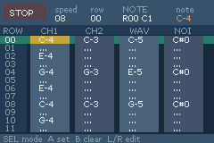
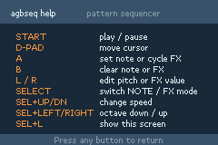

# agbseq

This is a pretty basic prototype of a music sequencer for the GBA with a tracker interface, as an experiment in agentic coding. It is still very much in a toy stage, and not really usable for anything serious yet. Requires devkitARM to build.

 